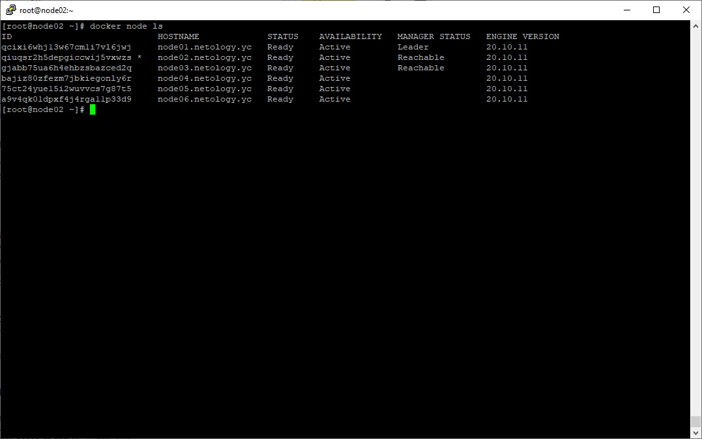
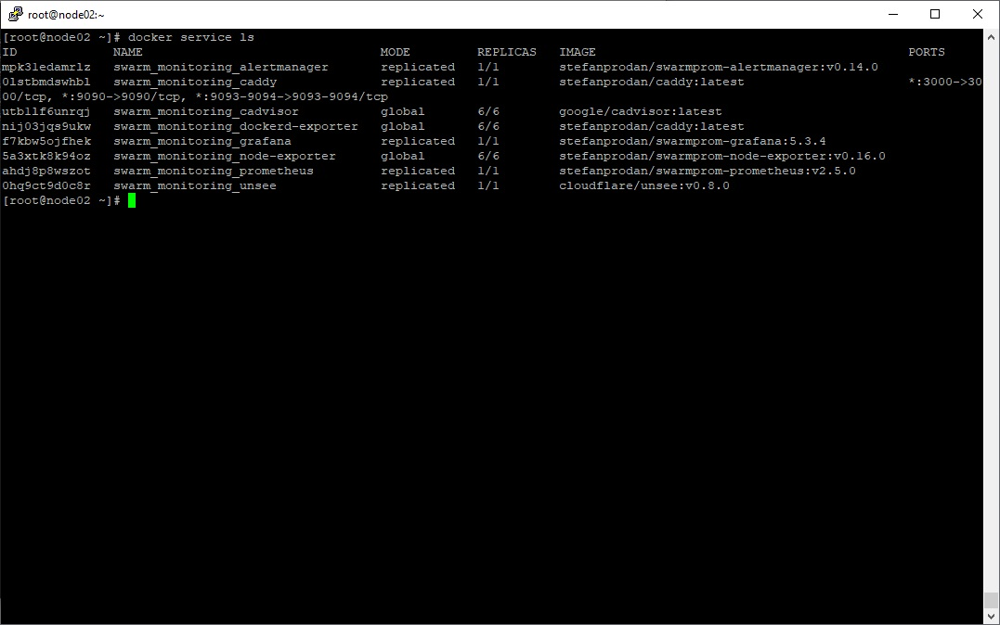

# Домашнее задание к занятию "5.5. Оркестрация кластером Docker контейнеров на примере Docker Swarm"

## Задача 1

*В чём отличие режимов работы сервисов в Docker Swarm кластере: replication и global?*

В режиме Replication создается только заданное количество экземпляров сервиса, в режиме Global сервис создается на 
всех узлах.

*Какой алгоритм выбора лидера используется в Docker Swarm кластере?*

В Docker Swarm кластере есть управляющие и рабочие узлы. Управляющие узлы отвечают за добавление/удаление 
контейнеров на рабочих узлах. В случае сбоя рабочего узла, новые задачи запускаются на других рабочих узлах. С целью 
отказоустойчивости создается несколько управляющих узлов (обычно минимум 3), один из которых является лидером, 
остальные находятся в состоянии доступности, в случае отказа лидера, лидером становится другой управляющий узел. 

*Что такое Overlay Network?*

Overlay Network - внутренняя частная сеть, объединяющая все узлы, участвующие в кластере swarm, для облегчения 
передачи данных между контейнерами и сервисами без использования маршрутизации на уровне ОС.

## Задача 2

Создать ваш первый Docker Swarm кластер в Яндекс.Облаке

## Задача 3

Создать ваш первый, готовый к боевой эксплуатации кластер мониторинга, состоящий из стека микросервисов.

