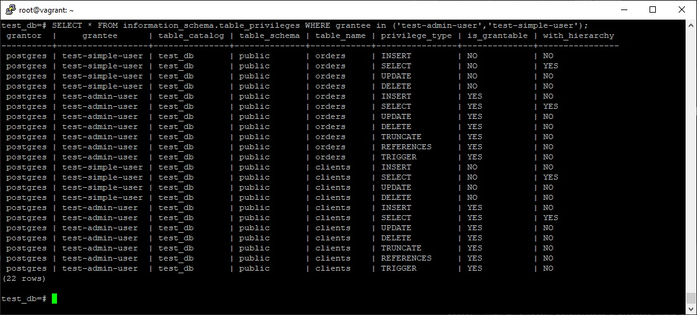

# Домашнее задание к занятию "6.2. SQL"


## Задача 1

```
root@vagrant:~# docker pull postgres:12
root@vagrant:~# docker volume create vol1
root@vagrant:~# docker volume create vol2
root@vagrant:~# docker run --rm --name pg-docker -e POSTGRES_PASSWORD=postgres -ti -p 5432:5432 -v 
vol1:/var/lib/postgresql/data -v vol2:/var/lib/postgresql postgres:12
```


## Задача 2

*итоговый список БД*


*описание таблиц (describe)*


*SQL-запрос для выдачи списка пользователей с правами над таблицами test_db*
```
SELECT * FROM information_schema.table_privileges WHERE grantee in ('test-admin-user','test-simple-user');
```

*список пользователей с правами над таблицами test_db*




## Задача 3

```
test_db=# INSERT INTO orders (name, price)
VALUES ('Шоколад', '10'), ('Принтер', 3000), ('Книга', 500), ('Монитор', 7000), ('Гитара', 4000);
INSERT 0 5
test_db=# INSERT INTO clients (lastname, country)
VALUES ('Иванов Иван Иванович', 'USA'), ('Петров Петр Петрович', 'Canada'), ('Иоганн Себастьян Бах', 'Japan'), ('Ронни Джеймс Дио', 'Russia'), ('Ritchie Blackmore', 'Russia');
INSERT 0 5
```
```buildoutcfg
test_db=# select count (*) from orders;
 count
-------
     5
(1 row)

test_db=# select count (*) from clients;
 count
-------
     5
(1 row)
```

## Задача 4

```
test_db=# update clients set product = 3 where id = 1;
UPDATE 1
test_db=# update clients set product = 4 where id = 2;
UPDATE 1
test_db=# update clients set product = 5 where id = 3;
UPDATE 1
```

```
test_db=# select * from clients WHERE product IS NOT null;
 id |       lastname       | country | product
----+----------------------+---------+---------
  1 | Иванов Иван Иванович | USA     |       3
  2 | Петров Петр Петрович | Canada  |       4
  3 | Иоганн Себастьян Бах | Japan   |       5
(3 rows)
```

## Задача 5

```
test_db=# explain select * from clients WHERE product IS NOT null;
                       QUERY PLAN
--------------------------------------------------------
 Seq Scan on clients  (cost=0.00..1.05 rows=3 width=47)
   Filter: (product IS NOT NULL)
(2 rows)

```
Оценка затратности выполнения запроса.  
Seq Scan - последовательное чтение данных из таблицы clients.  
cost=0.00 - затраты на обработку первой строки, cost=1.05 - затраты на обработку всех строк.  
rows=3 - приблизительное количество возвращаемых строк при выполнении Seq scan.  
width=47 - средний размер одной строки в байтах. 

## Задача 6

Создайте бэкап БД test_db и поместите его в volume, предназначенный для бэкапов (см. Задачу 1).

```
root@vagrant:~# docker exec -t pg-docker pg_dump -U postgres test_db -C -f /var/lib/postgresql/dump_test.sql
```

Остановите контейнер с PostgreSQL (но не удаляйте volumes).

```
root@vagrant:~# docker stop pg-docker
pg-docker
```

Поднимите новый пустой контейнер с PostgreSQL.

```
root@vagrant:~# docker run --rm --name pg-docker2 -e POSTGRES_PASSWORD=postgres -ti -p 5432:5432 -v 
vol3:/var/lib/postgresql/data -v vol2:/var/lib/postgresql postgres:12
```

Восстановите БД test_db в новом контейнере.

```
root@vagrant:~# psql -h 127.0.0.1 -U postgres
Password for user postgres:
psql (12.9 (Ubuntu 12.9-0ubuntu0.20.04.1))
Type "help" for help.

postgres=# CREATE ROLE "test-admin-user" SUPERUSER NOCREATEDB NOCREATEROLE NOINHERIT LOGIN;
postgres=# CREATE ROLE "test-simple-user" NOSUPERUSER NOCREATEDB NOCREATEROLE NOINHERIT LOGIN;
postgres=# exit

root@vagrant:~# docker exec -t pg-docker2 psql -U postgres -f /var/lib/postgresql/dump_test.sql
```