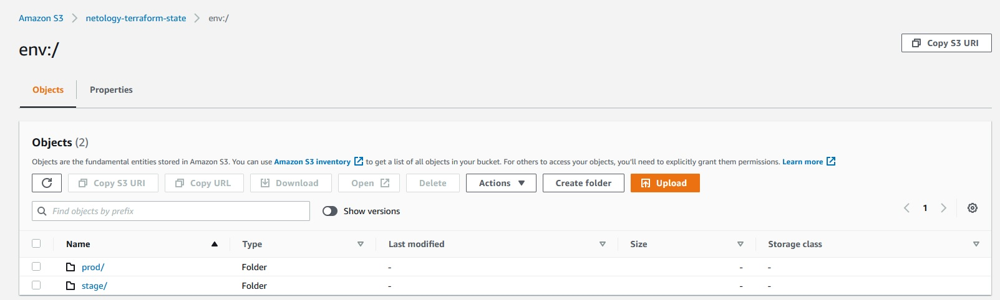

# Домашнее задание к занятию "7.3. Основы и принцип работы Терраформ"

## Задача 1. Создадим бэкэнд в S3 (необязательно, но крайне желательно).

Создаем файл s3.tf со следующим содержанием:
```buildoutcfg
provider "aws" {
    region = "eu-central-1"
}


resource "aws_s3_bucket" "terraform_state" {
    bucket = "netology-terraform-state"
    acl    = "private"

    versioning {
        enabled = true
}

resource "aws_dynamodb_table" "terraform_locks" {
    name = "netology-terraform-state-locks"
    billing_mode = "PAY_PER_REQUEST"
    hash_key = "LockID"

    attribute {
        name = "LockID"
        type = "S"
    }
}
```
После деплоя на сервере создается S3 хранилище. Добавим в s3.tf следующий блок:
```
terraform {
    backend "s3" {
        bucket = "netology-terraform-state"
        region = "eu-central-1"
        dynamodb_table = "netology-terraform-state-locks"
        encrypt = true
        key = "global/s3/terraform.tfstate"
    }
}

```
После terraform init  стейты создадутся в S3

## Задача 2. Инициализируем проект и создаем воркспейсы. 

Создаем файл main.tf:
```buildoutcfg
data "aws_ami" "ubuntu" {
  most_recent = true

  filter {
    name   = "name"
    values = ["ubuntu/images/hvm-ssd/ubuntu-focal-20.04-amd64-server-*"]
    }

  filter {
    name   = "virtualization-type"
    values = ["hvm"]
    }

  owners = ["099720109477"] # Canonical
}

locals {
  web_instance_type_map = {
    default = "t3.micro"
    stage = "t3.micro"
    prod = "t3.large"
  }
  web_instance_count_map = {
    default = 0
    stage = 1
    prod = 2
  }
  instances = {
    ins1 = 0
    ins2 = 1
  }
}

resource "aws_instance" "web" {
  ami           = data.aws_ami.ubuntu.id
  instance_type = local.web_instance_type_map[terraform.workspace]
  count = local.web_instance_count_map[terraform.workspace]

  tags = {
    Name = "Netology-${terraform.workspace}-${count.index}"
  }
}

resource "aws_instance" "web_1" {
  ami           = data.aws_ami.ubuntu.id
  instance_type = local.web_instance_type_map[terraform.workspace]
  for_each = local.instances
  lifecycle {
    create_before_destroy = true
  }
  tags = {
    Name = "Netology-${terraform.workspace}-${each.value}-foreach"
  }
}

```
В блоке **data** описываем образ для инстанса. В блоке **locals** - значения для типов инстансов, количество инстансов 
для 
каждого воркспейса и инстансы для цикла **for_each**. Ресурс **web** создает инстансы для каждого воркспейса в нужном 
количестве через **count**, **web_1** - создает инстансы в количестве, определяемом **for_each**. Также в этом блоке 
указан 
параметр жизненного цикла **create_before_destroy**.

Новые воркспейсы создаются командой: 

`terraform workspace new prod`

`terraform workspace new stage`

Вывод списка воркспейсов:
```buildoutcfg
vagrant@vagrant:~/terraform-aws$ terraform workspace list
* default
  prod
  stage

vagrant@vagrant:~/terraform-aws$
```

Переключение на воркспейс prod:
```buildoutcfg
vagrant@vagrant:~/terraform-aws$ terraform workspace select prod
Switched to workspace "prod".
vagrant@vagrant:~/terraform-aws$ terraform workspace list
  default
* prod
  stage

vagrant@vagrant:~/terraform-aws$
```

Terraform plan для prod:
```buildoutcfg
vagrant@vagrant:~/terraform-aws$ terraform plan
aws_instance.web[1]: Refreshing state... [id=i-0c382bdde14512b57]
aws_instance.web[0]: Refreshing state... [id=i-00d5271726cc891a3]

Terraform used the selected providers to generate the following execution plan. Resource actions are indicated with the following symbols:
  + create

Terraform will perform the following actions:

  # aws_dynamodb_table.terraform_locks will be created
  + resource "aws_dynamodb_table" "terraform_locks" {
      + arn              = (known after apply)
      + billing_mode     = "PAY_PER_REQUEST"
      + hash_key         = "LockID"
      + id               = (known after apply)
      + name             = "netology-terraform-state-locks"
      + read_capacity    = (known after apply)
      + stream_arn       = (known after apply)
      + stream_label     = (known after apply)
      + stream_view_type = (known after apply)
      + tags_all         = (known after apply)
      + write_capacity   = (known after apply)

      + attribute {
          + name = "LockID"
          + type = "S"
        }

      + point_in_time_recovery {
          + enabled = (known after apply)
        }

      + server_side_encryption {
          + enabled     = (known after apply)
          + kms_key_arn = (known after apply)
        }

      + ttl {
          + attribute_name = (known after apply)
          + enabled        = (known after apply)
        }
    }

  # aws_instance.web_1["ins1"] will be created
  + resource "aws_instance" "web_1" {
      + ami                                  = "ami-0589e33e9ae388208"
      + arn                                  = (known after apply)
      + associate_public_ip_address          = (known after apply)
      + availability_zone                    = (known after apply)
      + cpu_core_count                       = (known after apply)
      + cpu_threads_per_core                 = (known after apply)
      + disable_api_termination              = (known after apply)
      + ebs_optimized                        = (known after apply)
      + get_password_data                    = false
      + host_id                              = (known after apply)
      + id                                   = (known after apply)
      + instance_initiated_shutdown_behavior = (known after apply)
      + instance_state                       = (known after apply)
      + instance_type                        = "t3.large"
      + ipv6_address_count                   = (known after apply)
      + ipv6_addresses                       = (known after apply)
      + key_name                             = (known after apply)
      + monitoring                           = (known after apply)
      + outpost_arn                          = (known after apply)
      + password_data                        = (known after apply)
      + placement_group                      = (known after apply)
      + placement_partition_number           = (known after apply)
      + primary_network_interface_id         = (known after apply)
      + private_dns                          = (known after apply)
      + private_ip                           = (known after apply)
      + public_dns                           = (known after apply)
      + public_ip                            = (known after apply)
      + secondary_private_ips                = (known after apply)
      + security_groups                      = (known after apply)
      + source_dest_check                    = true
      + subnet_id                            = (known after apply)
      + tags                                 = {
          + "Name" = "Netology-prod-0-foreach"
        }
      + tags_all                             = {
          + "Name" = "Netology-prod-0-foreach"
        }
      + tenancy                              = (known after apply)
      + user_data                            = (known after apply)
      + user_data_base64                     = (known after apply)
      + vpc_security_group_ids               = (known after apply)

      + capacity_reservation_specification {
          + capacity_reservation_preference = (known after apply)

          + capacity_reservation_target {
              + capacity_reservation_id = (known after apply)
            }
        }

      + ebs_block_device {
          + delete_on_termination = (known after apply)
          + device_name           = (known after apply)
          + encrypted             = (known after apply)
          + iops                  = (known after apply)
          + kms_key_id            = (known after apply)
          + snapshot_id           = (known after apply)
          + tags                  = (known after apply)
          + throughput            = (known after apply)
          + volume_id             = (known after apply)
          + volume_size           = (known after apply)
          + volume_type           = (known after apply)
        }

      + enclave_options {
          + enabled = (known after apply)
        }

      + ephemeral_block_device {
          + device_name  = (known after apply)
          + no_device    = (known after apply)
          + virtual_name = (known after apply)
        }

      + metadata_options {
          + http_endpoint               = (known after apply)
          + http_put_response_hop_limit = (known after apply)
          + http_tokens                 = (known after apply)
          + instance_metadata_tags      = (known after apply)
        }

      + network_interface {
          + delete_on_termination = (known after apply)
          + device_index          = (known after apply)
          + network_interface_id  = (known after apply)
        }

      + root_block_device {
          + delete_on_termination = (known after apply)
          + device_name           = (known after apply)
          + encrypted             = (known after apply)
          + iops                  = (known after apply)
          + kms_key_id            = (known after apply)
          + tags                  = (known after apply)
          + throughput            = (known after apply)
          + volume_id             = (known after apply)
          + volume_size           = (known after apply)
          + volume_type           = (known after apply)
        }
    }

  # aws_instance.web_1["ins2"] will be created
  + resource "aws_instance" "web_1" {
      + ami                                  = "ami-0589e33e9ae388208"
      + arn                                  = (known after apply)
      + associate_public_ip_address          = (known after apply)
      + availability_zone                    = (known after apply)
      + cpu_core_count                       = (known after apply)
      + cpu_threads_per_core                 = (known after apply)
      + disable_api_termination              = (known after apply)
      + ebs_optimized                        = (known after apply)
      + get_password_data                    = false
      + host_id                              = (known after apply)
      + id                                   = (known after apply)
      + instance_initiated_shutdown_behavior = (known after apply)
      + instance_state                       = (known after apply)
      + instance_type                        = "t3.large"
      + ipv6_address_count                   = (known after apply)
      + ipv6_addresses                       = (known after apply)
      + key_name                             = (known after apply)
      + monitoring                           = (known after apply)
      + outpost_arn                          = (known after apply)
      + password_data                        = (known after apply)
      + placement_group                      = (known after apply)
      + placement_partition_number           = (known after apply)
      + primary_network_interface_id         = (known after apply)
      + private_dns                          = (known after apply)
      + private_ip                           = (known after apply)
      + public_dns                           = (known after apply)
      + public_ip                            = (known after apply)
      + secondary_private_ips                = (known after apply)
      + security_groups                      = (known after apply)
      + source_dest_check                    = true
      + subnet_id                            = (known after apply)
      + tags                                 = {
          + "Name" = "Netology-prod-1-foreach"
        }
      + tags_all                             = {
          + "Name" = "Netology-prod-1-foreach"
        }
      + tenancy                              = (known after apply)
      + user_data                            = (known after apply)
      + user_data_base64                     = (known after apply)
      + vpc_security_group_ids               = (known after apply)

      + capacity_reservation_specification {
          + capacity_reservation_preference = (known after apply)

          + capacity_reservation_target {
              + capacity_reservation_id = (known after apply)
            }
        }

      + ebs_block_device {
          + delete_on_termination = (known after apply)
          + device_name           = (known after apply)
          + encrypted             = (known after apply)
          + iops                  = (known after apply)
          + kms_key_id            = (known after apply)
          + snapshot_id           = (known after apply)
          + tags                  = (known after apply)
          + throughput            = (known after apply)
          + volume_id             = (known after apply)
          + volume_size           = (known after apply)
          + volume_type           = (known after apply)
        }

      + enclave_options {
          + enabled = (known after apply)
        }

      + ephemeral_block_device {
          + device_name  = (known after apply)
          + no_device    = (known after apply)
          + virtual_name = (known after apply)
        }

      + metadata_options {
          + http_endpoint               = (known after apply)
          + http_put_response_hop_limit = (known after apply)
          + http_tokens                 = (known after apply)
          + instance_metadata_tags      = (known after apply)
        }

      + network_interface {
          + delete_on_termination = (known after apply)
          + device_index          = (known after apply)
          + network_interface_id  = (known after apply)
        }

      + root_block_device {
          + delete_on_termination = (known after apply)
          + device_name           = (known after apply)
          + encrypted             = (known after apply)
          + iops                  = (known after apply)
          + kms_key_id            = (known after apply)
          + tags                  = (known after apply)
          + throughput            = (known after apply)
          + volume_id             = (known after apply)
          + volume_size           = (known after apply)
          + volume_type           = (known after apply)
        }
    }

  # aws_s3_bucket.terraform_state will be created
  + resource "aws_s3_bucket" "terraform_state" {
      + acceleration_status         = (known after apply)
      + acl                         = "private"
      + arn                         = (known after apply)
      + bucket                      = "netology-terraform-state"
      + bucket_domain_name          = (known after apply)
      + bucket_regional_domain_name = (known after apply)
      + force_destroy               = false
      + hosted_zone_id              = (known after apply)
      + id                          = (known after apply)
      + region                      = (known after apply)
      + request_payer               = (known after apply)
      + tags_all                    = (known after apply)
      + website_domain              = (known after apply)
      + website_endpoint            = (known after apply)

      + versioning {
          + enabled    = true
          + mfa_delete = false
        }
    }

Plan: 4 to add, 0 to change, 0 to destroy.

────────────────────────────────────────────────────────────────────────────────────────────────────────────────────────────────────────────────────────────────────────────────────────────────────────────────────────────────────────────

Note: You didn't use the -out option to save this plan, so Terraform can't guarantee to take exactly these actions if you run "terraform apply" now.
Releasing state lock. This may take a few moments...
vagrant@vagrant:~/terraform-aws$
```
Скриншоты S3:


Скриншоты EC2:
