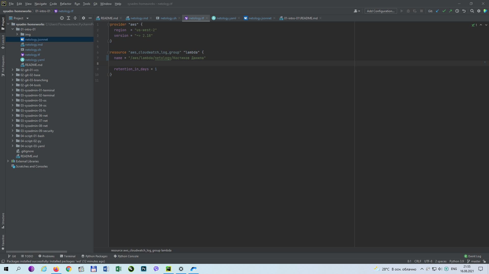
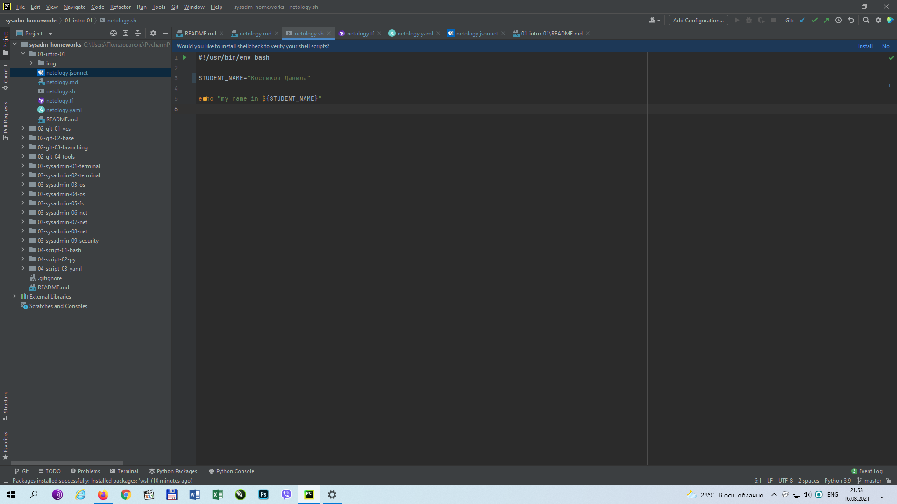
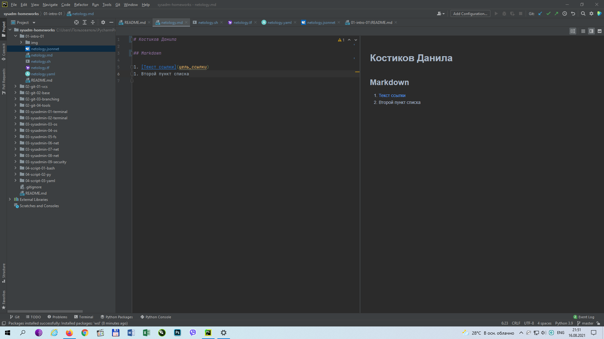
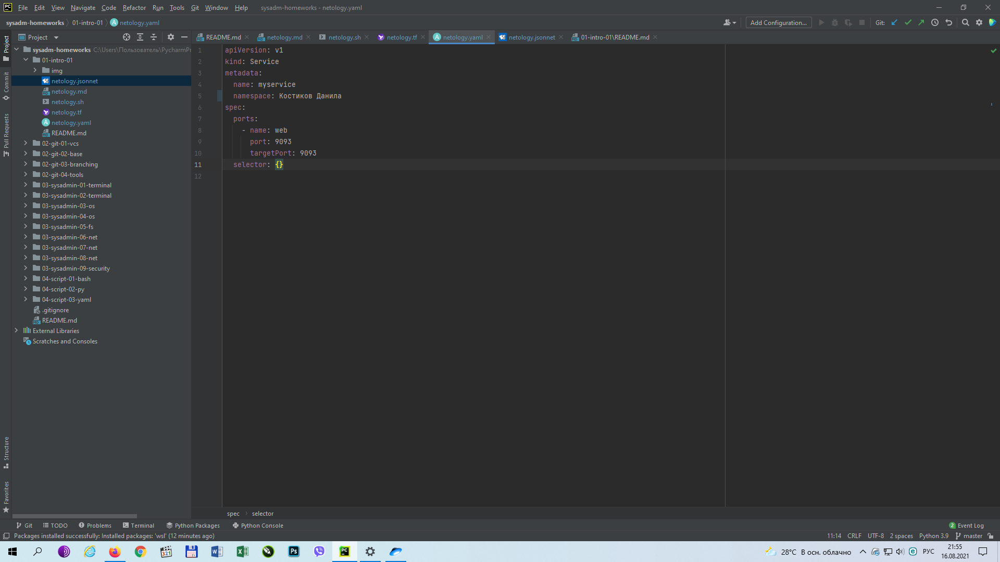
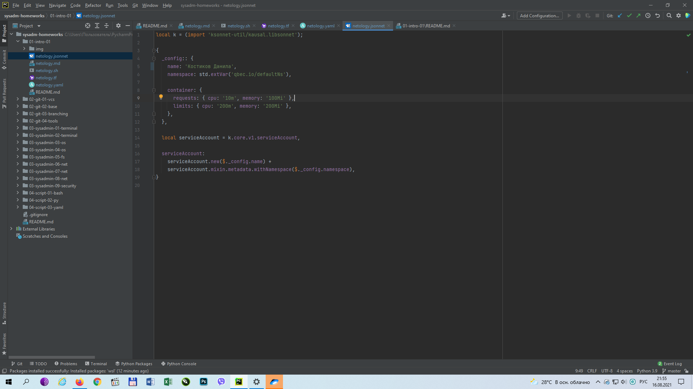

## Задание 1

Скриншоты:
    
- Terraform: 
- Bash: 
- Markdown: 
- Yaml: 
- Jsonnet: 

## Задание 2

1. Планирование и проектирование

    Менеджер ставит задачу на внедрение новой функции. 
    Разработчики и тестировщики оценивают время и этапы выполнения.
    DevOps-инженер определяет набор инструментов для создания единой контейнерной среды разработки.

2. Разработка и тестирование

    DevOps-инженер разворачивает среду разработки, настраивает скрипты для автоматизации тестирования, сборки и развертывания. 
    Разработчики работают непосредственно над кодом, разбивая его на отдельные модули. Проводят анализ и тестирование, контроль версий.
    Готовый код проходит автоматизированное и "ручное" тестирование, сборку и развертывание в тестовой среде. В случае непрохождения тестов код отправляется на доработку.
 
3. Развертывание

    После успешного прохождения тестов, дистрибутив автоматически разворачивается в основную среду. 
    Менеджер проверяет функционал на соответствие требованиям задачи.
    Разработчики вносят изменения в релиз путем выпуска обновлений.
    В случае необходимости происходит откат изменений.

4. Мониторинг

    На каждом этапе происходит фиксирование ошибок тестирования, журналирование изменений, автоматическое оповещение о возникающих ошибках. DevOps-инженер контролирует все этапы разработки, настраивает автоматизацию процессов, принимает решения о смене инструментов разработки.